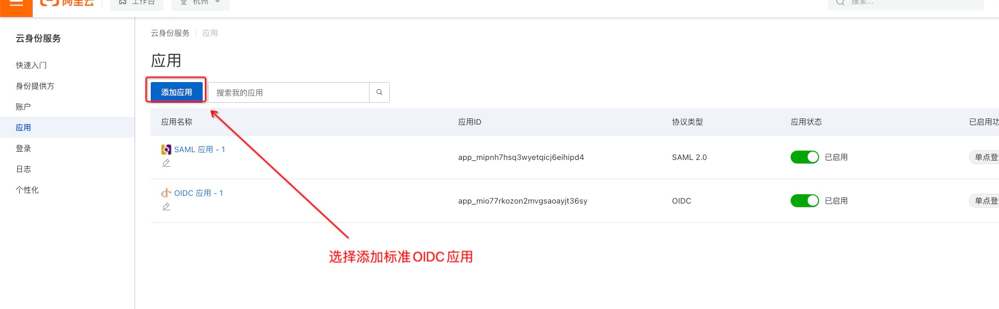
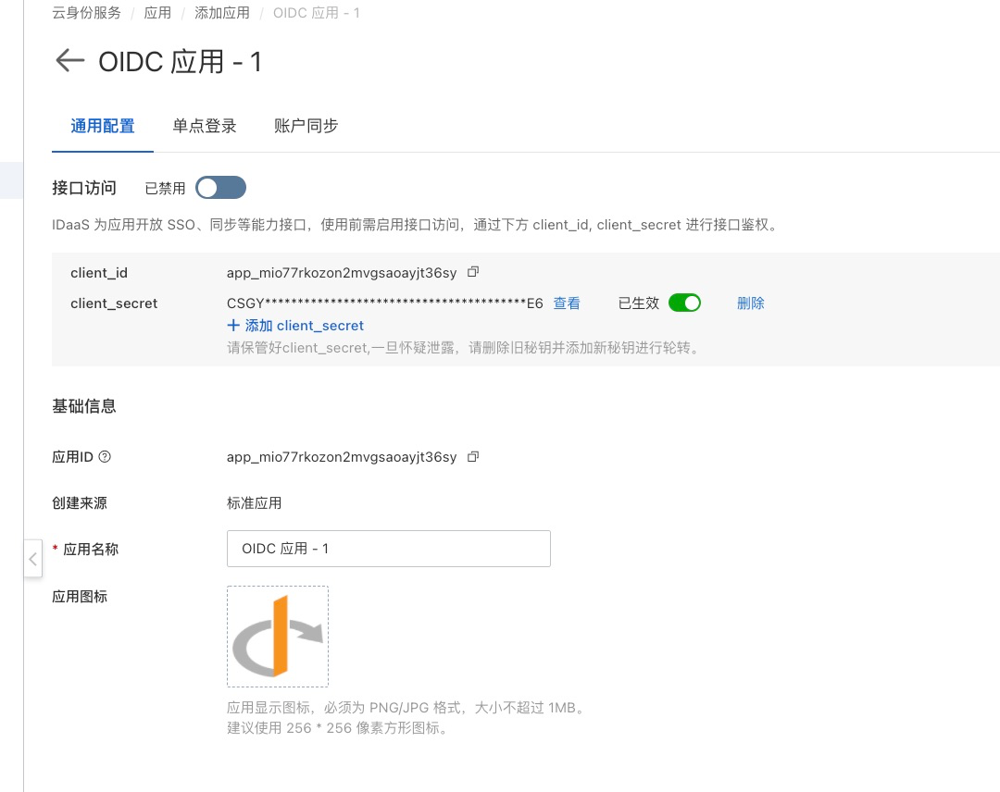
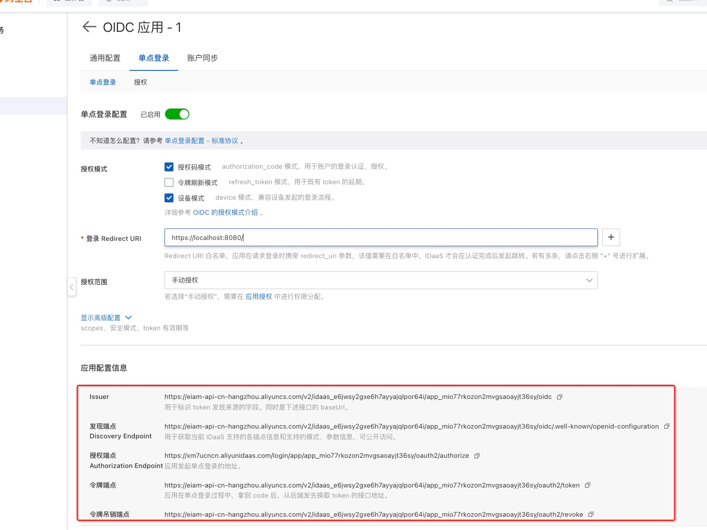
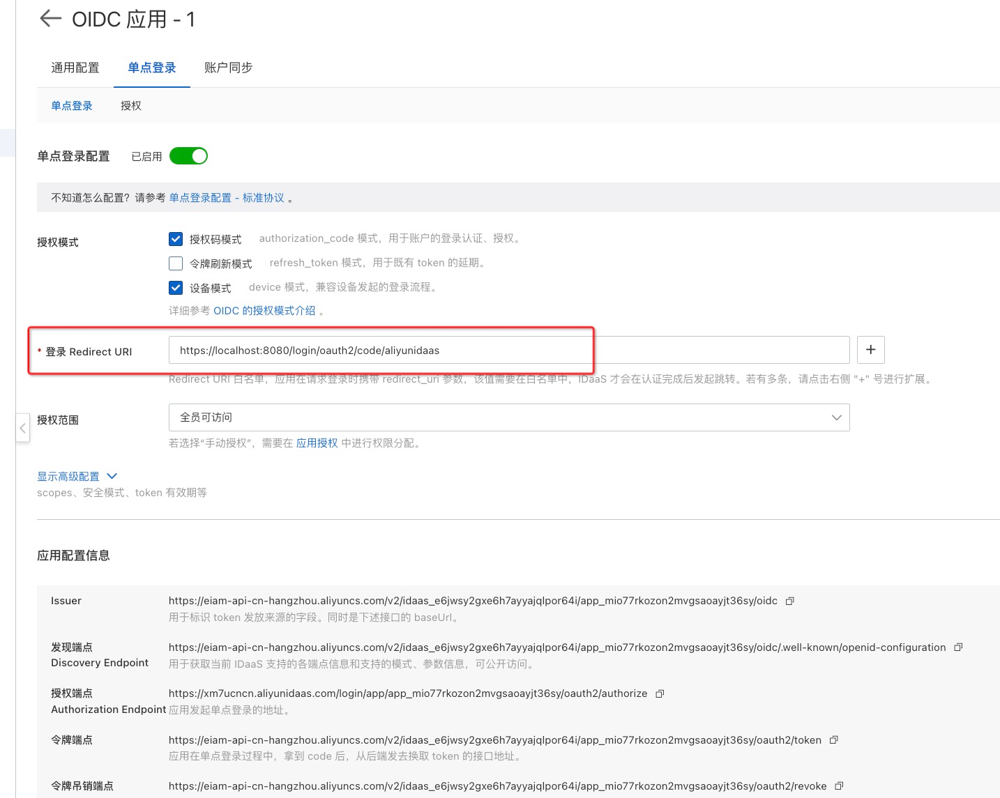
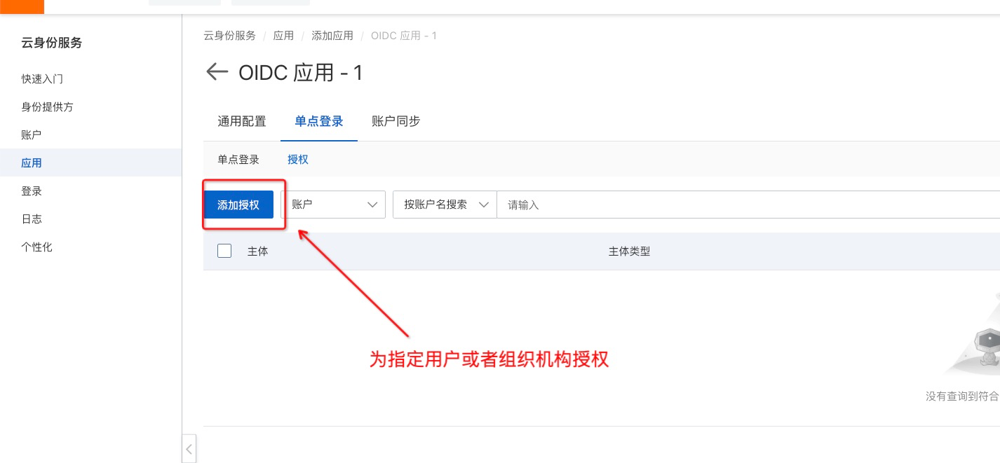
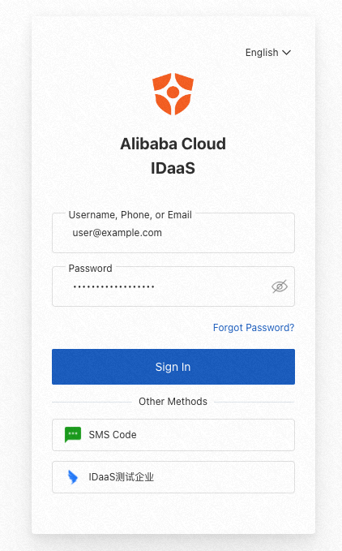
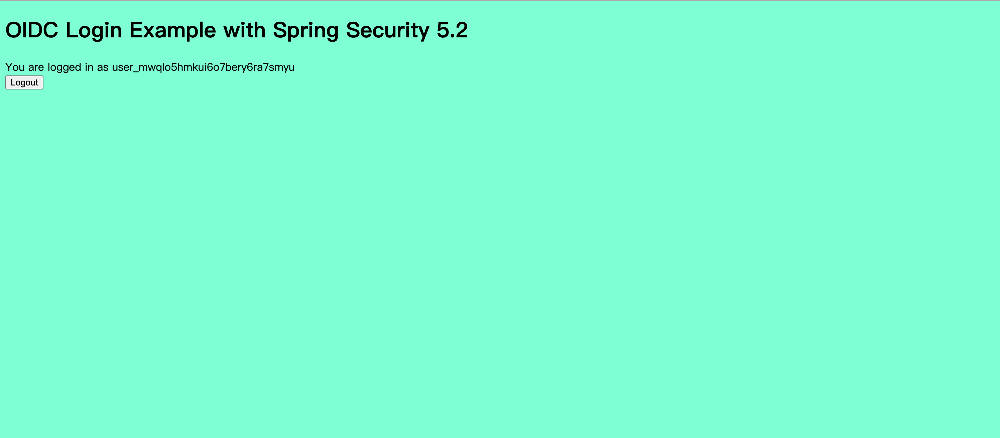
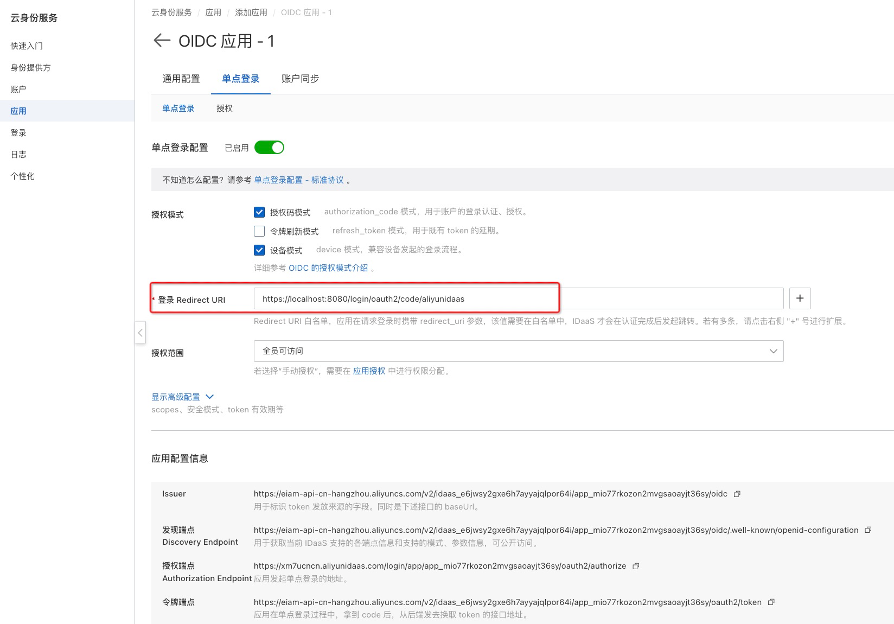

# 快速开始

## 第一步：注册应用

****

## 第二步：修改配置

修改`application.yml`文件中的 idp 配置

```yaml
spring:
    security:
        oauth2:
            client:
                registration:
                    aliyunidaas: # aliyunidaas 即为 {registrationId}, 可为任意字符串
                        client-id:  # idaas 中拿到的 client-id
                        client-secret:  # idaas 中拿到的 client-secret
                        scope:
                          - openid
                provider:
                    aliyunidaas: # aliyunidaas 即为 {registrationId}, 可为任意字符串
                        issuer-uri:  # idaas 中拿到的 issuer
```

以上信息在IDaaS实例中查看位置，如下图：



## 第三步：在 IDaaS 中添加 RP 重定向地址

- 本地启动项目
- 按照以下规则获取重定向地址 redirect_uri，并填写到 idaas 中。
    - `{baseUrl}/login/oauth2/code/{registrationId}`



## 第四步：配置登出重定向地址


## 第五步：授权(可选)



- 如图所示，在应用中为某一用户授权

## 第六步：访问

- 访问 `http://localhost:8080`
- 此时会跳转到登录认证页面



- 登录认证成功后会跳转回 `http://localhost:8080` ，并显示以下页面



通过点击 [Logout] 可以退出 IDaaS 会话

# 详细实现

## 在 idaas 注册应用

同快速开始

## RP 实现

### 依赖项

- 使用 SpringBoot 版本为 2.7.3，其余依赖都使用 spring-boot-dependencies 中的默认版本号

- OIDC 依赖

```xml
  <dependency>
      <groupId>org.springframework.boot</groupId>
      <artifactId>spring-boot-starter-oauth2-client</artifactId>
  </dependency>
  <dependency>
      <groupId>org.springframework.security</groupId>
      <artifactId>spring-security-openid</artifactId>
  </dependency>
```

- security 相关依赖

```xml
  <dependency>
      <groupId>org.springframework.boot</groupId>
      <artifactId>spring-boot-starter-security</artifactId>
  </dependency>
```
- web 相关

```xml
  <dependency>
      <groupId>org.springframework.boot</groupId>
      <artifactId>spring-boot-starter-web</artifactId>
  </dependency>
```
-
    - thymeleaf 相关依赖

```xml
<dependency>
    <groupId>org.thymeleaf.extras</groupId>
    <artifactId>thymeleaf-extras-springsecurity5</artifactId>
</dependency>

<dependency>
    <groupId>org.springframework.boot</groupId>
    <artifactId>spring-boot-starter-thymeleaf</artifactId>
</dependency>
```

### 保护路径配置

- 创建 SecurityConfig 类
    - 定义受 OIDC 保护的路径

```java

@EnableWebSecurity
public class SecurityConfig extends WebSecurityConfigurerAdapter {
    @Override
    protected void configure(HttpSecurity http) throws Exception {
        http.authorizeRequests()
                .antMatchers("/logout-success").permitAll()
                .anyRequest().authenticated()
                .and().logout().logoutSuccessUrl("/logout-success")
                .and().logout().logoutSuccessHandler(oidcLogoutSuccessHandler())
                .and().oauth2Login();
    }
}
```

### 创建index页面

在 resources 目录下创建 templates 目录，并创建一个 index.html 页面，用以后续的访问。

```html
<!doctype html>
<html xmlns="http://www.w3.org/1999/xhtml" xmlns:th="https://www.thymeleaf.org"
      xmlns:sec="https://www.thymeleaf.org/thymeleaf-extras-springsecurity5">
<head>
    <title>Spring Security OIDC</title>
</head>
<body style="background-color: aquamarine;">
<h1>OIDC Login Example with Spring Security 5.2</h1>
<div>You are logged in as <span sec:authentication="name"></span></div>
<div>
    <form th:action="@{/logout}" method="post">
        <input type="submit" value="Logout"/>
    </form>
</div>
</body>
</html>
```

### 访问端点定义

- 此处定义了 4 个端点
    - `"/oidc-principal"` 和 `"/oidc-principal2"`会返回用户的相关信息
    - `"/"`会返回前面定义的 html 页面
    - `"/sensitive_resource"` 会返回 `"success"`字符串

```java

@RestController
public class SampleController {

    @GetMapping("/oidc-principal")
    public OAuth2User getOidcUserPrincipal(@AuthenticationPrincipal OAuth2User principal) {
        return principal;
    }

    @GetMapping("/oidc-principal2")
    public Object getOidcUserPrincipal2() {
        Authentication authentication = SecurityContextHolder.getContext().getAuthentication();
        if (authentication.getPrincipal() instanceof OidcUser) {
            OidcUser principal = ((OidcUser)authentication.getPrincipal());
            return principal;
        } else {
            return authentication.getPrincipal();
        }
    }

    @GetMapping("/sensitive_resource")
    public String getSensitiveResource() {
        return "success";
    }
}
```

### 配置 IdP 信息

- 在 `application.yml`中添加在idaas注册时拿到的 IdP 配置信息，包括以下内容
    - client-id
    - client-secret
    - issuer-uri

```yaml
spring:
    security:
        oauth2:
            client:
                registration:
                    aliyunidaas: # aliyunidaas 即为 {registrationId}, 可为任意字符串
                        client-id: <clientId>  # idaas 中拿到的 client-id
                        client-secret: <clientSecret> # idaas 中拿到的 client-secret
                        scope:
                          - openid
                provider:
                    aliyunidaas: # aliyunidaas 即为 {registrationId}, 可为任意字符串
                        issuer-uri: <issuer> # idaas 中拿到的 issuer
```

### 获取 RP 的配置信息

- 重定向地址 redirect_uri：`{baseUrl}/login/oauth2/code/{registrationId}`
    - 其中 baseUrl 和 registrationId 可通过如下配置修改

```yaml
server:
    port: 8080
    servlet:
        context-path: /test   # baseUrl
spring:
    security:
        oauth2:
            client:
                registration:
                    aliyunidaas: # aliyunidaas 即为 {registrationId}, 可为任意字符串
                        client-id:  # idaas 中拿到的 client-id
                        client-secret:  # idaas 中拿到的 client-secret
                        scope:
                          - openid
                provider:
                    aliyunidaas: # aliyunidaas 即为 {registrationId}, 可为任意字符串
                        issuer-uri:  # idaas 中拿到的 issuer
```

## 在 idaas 中添加 RP 配置

- 添加 sp 配置的方式：按照下图填写上面获取到的重定向地址 redirect_uri 即可



## 访问

同快速开始
